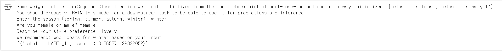

# Seasonal Outfit Recommender

이 프로젝트는 사용자의 스타일 선호도를 입력받아 선택된 계절에 맞는 의상을 추천합니다. **SentenceTransformer**와 **Hugging Face Transformers**를 활용하여 텍스트 유사도를 분석하고, 사용자의 입력과 가장 잘 어울리는 의상을 제안합니다.
## 예시 이미지
---


## 사용한 패키지 및 버전
  Sentence Transformers v3.2
  Python 3.12.7
  Transformers 4.46.3


## 실행 방법

1. Install dependencies:
   ```bash
   pip install sentence-transformers transformers

## 참고자료
1. https://huggingface.co/sentence-transformers/all-MiniLM-L6-v2
2. https://huggingface.co/google-bert/bert-base-uncased

3. 허깅페이스 트랜스포머를 활용한 감성분석 (Sentiment Analysis Using Huggingface Transformer)
   https://www.youtube.com/watch?v=7utJC7zdeh4


